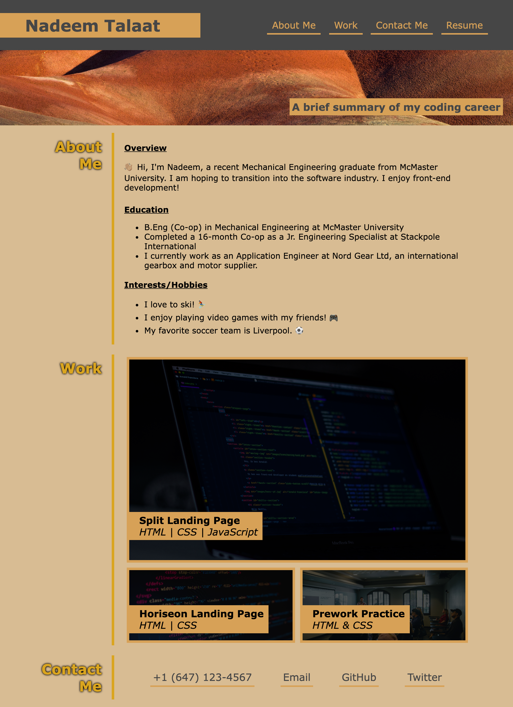

# Project-Portfolio
## Description
This web app is designed to act as a project portfolio for potential employers.

Through this web app, I was able to learn about designing a web app from scratch, and was able to implement basic HTML & advanced CSS styling, using Flexbox.
## Installation

Load index.html file to access landing page. CSS styling is external but linked within index.html page.
## Usage
The directory at the top of the page can be used to access different sections of the page. The "Resume" link can also be used to open a resume PDF (sample resume for now.)

In the "Work" section, there are links to my GitHub repositories for individual coding projects I have worked on.

In the "Contact Me" section, there are various links to different ways I can be contacted.

Page can alternatively be accessed [here](https://nadeemtalaat.github.io/Project-Portfolio/).

## Credits

- Nadeem Talaat

## License

[MIT](https://choosealicense.com/licenses/mit/)
